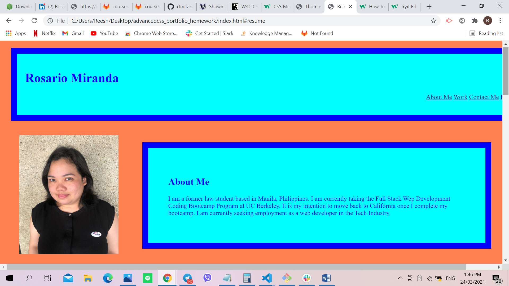

# Advanced CSS Portfolio Homework

## Site Picture


## Technologies Used
- HTML - creates elements on the DOM
- CSS - adds style to html elements
- GitBash - for cloning repository and pushing code to GitHub
- GitHub - holds repository that deploys to GitHub Pages

## Summary
This file contains the webpage for my portfolio. It also contains code that was created using HTML and CSS. 

## Code Snippet
```html
<header>
        <h1>Rosario Miranda</h1>
        <nav>
            <ul>
                <li><a href="#aboutme">About Me</a></li>
                <li><a href="#work">Work</a></li>
                <li><a href="#contactme">Contact Me</a></li>
                <li><a href="MirandaResume2021.docx">Resume</a></li>
            </ul>
        </nav>
    </header>
```

```html
<html>

</html>
```

## Author Links 
[LinkedIn](https://www.linkedin.com/in/rosario-miranda-b81170132/)
[GitHub](https://github.com/rtmiranda18)

